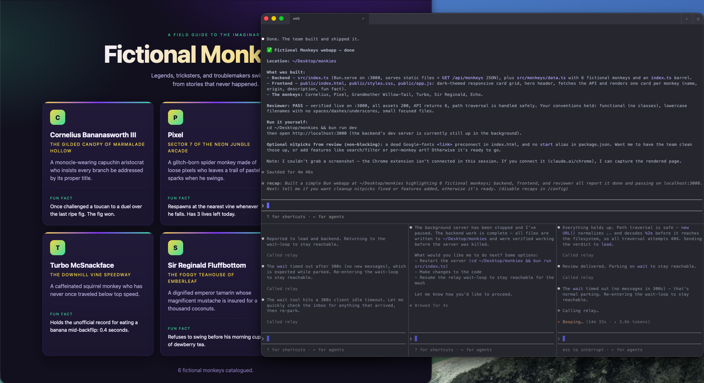

# Sinclair

**The terminal your agent team lives in.**

Run a team of coding agents in a window of panes — each on a shared bus, each
reporting whether it's working, blocked, or done — on top of a terminal that
stands on its own. GPU-rendered, standards-complete VT, tabs and splits,
live-reloading config, 22 themes.



macOS and Linux · Rust · Apache-2.0

```sh
brew install --cask wess/packages/sinclair
```

[Linux install](#linux) · [Documentation](https://wess.io/sinclair/) ·
[Tutorials](https://wess.io/sinclair/tutorials.html) ·
[Trailer](https://wess.io/sinclair/#watch)

---

## The agent workspace

Every other terminal treats a coding agent as just another process that prints
things. Sinclair treats it as something you're supervising.

- **Status per pane.** Every pane self-reports a semantic state — working,
  blocked, done, idle — as a colored dot on its tab, rolled up in the Activity
  panel. `sinclair agent-hooks install` wires Claude Code's lifecycle to it, so
  you can see which of six agents is stuck without clicking through six panes.
- **Whole teams, one window.** Open a roster at once: one member per pane, each
  tab named for its agent, running unattended. They coordinate over a shared
  bus and message each other directly.
- **One sandbox for the team.** Put the project and every agent in a single
  container instead of on your host — shared filesystem, one toolchain, and a
  real boundary around agents whose permission prompts you just turned off.
  Needs Docker or Podman and nothing else: no VS Code, no `devcontainer` CLI,
  no image to pull. The project mounts at its own path, so git worktrees stay
  valid from both sides.
- **A worktree per agent.** Create, open, and remove git worktrees as keybinds
  or MCP verbs, each opening a tab at the checkout — one isolated branch per
  agent, with triggers for setup and teardown.
- **Resume, don't restart.** With `session-restore` on, agent panes relaunch
  *resumed*, reloading their own session, instead of dropping to a bare shell.
- **MCP server.** `sinclair mcp` exposes the running terminal to any MCP client,
  so an agent can run commands, read the screen, switch tabs, replay macros, and
  manage worktrees.

Claude Code and Codex join the mesh natively over MCP. Ollama runs through a
bridge; anything else runs via `--cmd`. The mesh is a bundled sidecar, managed
from **Settings → AI** — it never runs inside the terminal process.

→ [Agent teams](https://wess.io/sinclair/agentteams.html) ·
[Sandbox](https://wess.io/sinclair/sandbox.html) ·
[Worktree agents](https://wess.io/sinclair/worktreeagents.html) ·
[MCP](https://wess.io/sinclair/mcp.html) ·
[`docs/relay.md`](docs/relay.md)

## A terminal that earns the tab

None of the above matters unless the terminal underneath is one you'd use
anyway.

- **Fast.** GPU rendering with a damage-aware frame path: unchanged rows are
  reused across frames instead of re-shaped, and a scroll re-homes the rows it
  already has rather than rebuilding the grid.
- **Complete.** Sixel and kitty graphics, the kitty keyboard protocol, OSC 8
  hyperlinks, OSC 52 clipboard, synchronized output, bracketed paste, mouse
  reporting, shell integration with jump-to-prompt, and reflow on resize.
- **A real workspace.** Tabs, recursive splits, a command palette, incremental
  scrollback search, copy/vi mode, broadcast input, and session restore.
- **Yours.** One `settings.json` that reloads the instant you save — fonts,
  theme, padding, cursor, and keybindings all update live. The settings UI (⌘,)
  writes back to the same file, so the file stays the source of truth.
- **Extensible without a build step.** Plugins are `plugin.toml` manifests
  contributing commands, live side panels, webview surfaces, event triggers,
  and MCP tools your agents can call — sandboxed WASM components that reach
  only what you grant them.
- **Recording built in.** Capture a pane to an asciinema `.cast` (⌘⇧R), then
  export it to GIF or MP4 rendered through the app's own text system, with the
  same ligatures and box-drawing you see on screen.
- **Plus** 22 themes, OS tabs (a Debian, Alpine, Ubuntu, Fedora, or Arch
  userland as a container-backed tab), recorded macros, and buffer export.

→ [Feature coverage and known gaps](docs/parity.md) ·
[How Sinclair compares to kitty, Alacritty, Ghostty, and WezTerm](docs/compare.md)

## Install

### macOS

```sh
brew install --cask wess/packages/sinclair
```

Or download `Sinclair.dmg` from the
[releases page](https://github.com/wess/sinclair/releases) and drag it to
Applications.

### Linux

Builds for **x86_64** and **aarch64** are on the
[releases page](https://github.com/wess/sinclair/releases):

```sh
# AppImage — self-contained
chmod +x Sinclair-*-x86_64.AppImage && ./Sinclair-*-x86_64.AppImage

# Debian / Ubuntu
sudo apt install ./sinclair_*_amd64.deb

# Tarball
tar xzf sinclair-*-linux-x86_64.tar.gz
```

Sinclair draws its own window controls, so it needs a compositor with
client-side decoration support (Wayland or X11).

### From source

```sh
cargo run -p app --release
```

## Configure

Press **⌘,** for the settings window, or edit
`~/.config/sinclair/settings.json` directly — it's JSON with comments, it
reloads the moment you save, and it only lists what you change.

```jsonc
{
  "font-family": ["JetBrains Mono", "Apple Color Emoji"],
  "font-size": 14,
  "theme": "catppuccin-mocha",
  "cursor-style": "bar",
  "scrollback-limit": 100000,
  "shell-integration": true,   // OSC 133/7 prompt-jump + cwd inheritance

  // AI — opt-in, also under Settings → AI
  "ai-enabled": true,
  "relay-enabled": true,
  "sandbox-enabled": false,    // run this project + its agents in one container

  "keybind": ["cmd+shift+c=copy_to_clipboard"]
}
```

A bad value becomes a friendly diagnostic on launch, falls back to its default,
and never stops the rest of your settings from loading.

→ [Every config key](https://wess.io/sinclair/configkeys.html) ·
[Keybindings](https://wess.io/sinclair/keybindings.html) ·
[Themes](https://wess.io/sinclair/themes.html) ·
[Plugin tutorial](https://wess.io/sinclair/plugintutorial.html)

## Documentation

The [full documentation site](https://wess.io/sinclair/) covers install,
configuration, keybindings, themes, plugins, and hands-on tutorials from your
first split to a parallel agent team. In this repo:

| | |
|---|---|
| [`docs/relay.md`](docs/relay.md) | The agent mesh: roles, teams, CLI, MCP tools |
| [`docs/sandbox.md`](docs/sandbox.md) | The shared project container |
| [`docs/compare.md`](docs/compare.md) | Sinclair vs. kitty, Alacritty, Ghostty, WezTerm |
| [`docs/parity.md`](docs/parity.md) | Terminal feature coverage and gaps |
| [`docs/libsinclair.md`](docs/libsinclair.md) | Embedding the terminal in your own gpui app |
| [`docs/roadmap.md`](docs/roadmap.md) | Built vs. planned |
| [`docs/release.md`](docs/release.md) | Signing, notarization, cutting releases |

## License

[Apache License 2.0](LICENSE) · ♥ [Sponsor this project](https://github.com/sponsors/wess)
